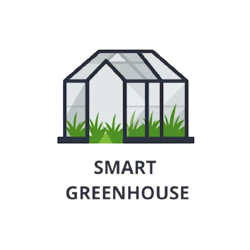
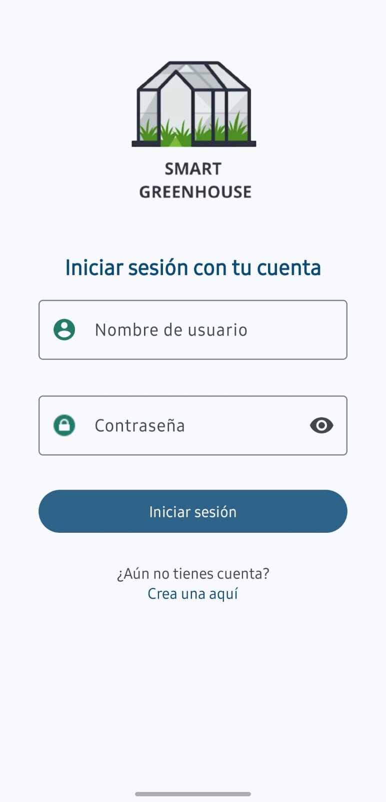
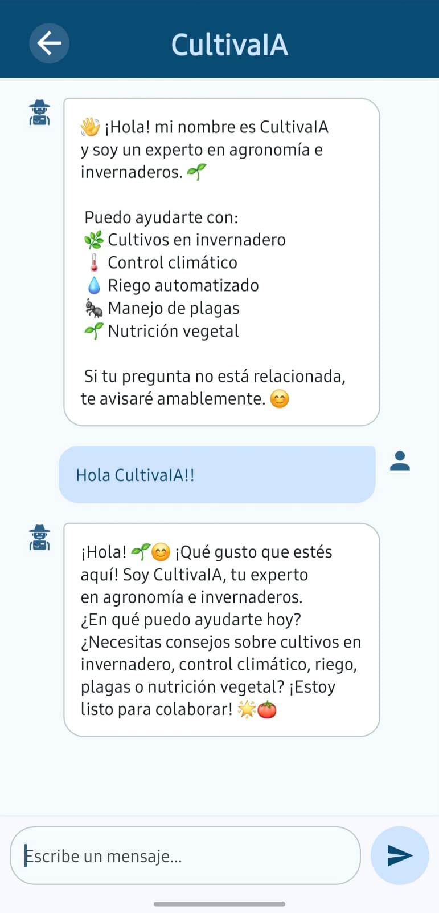
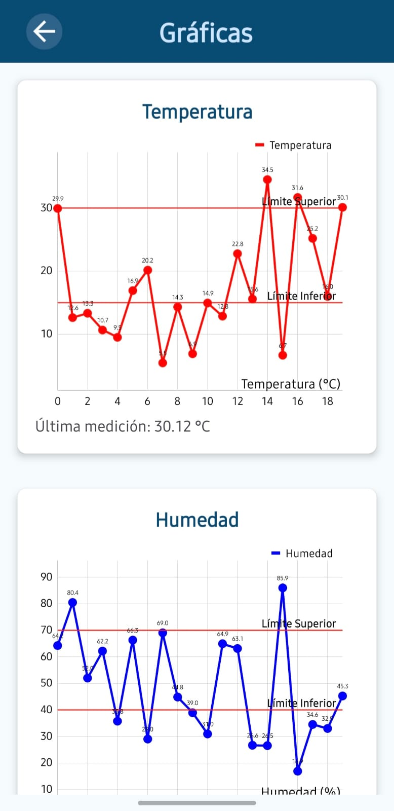
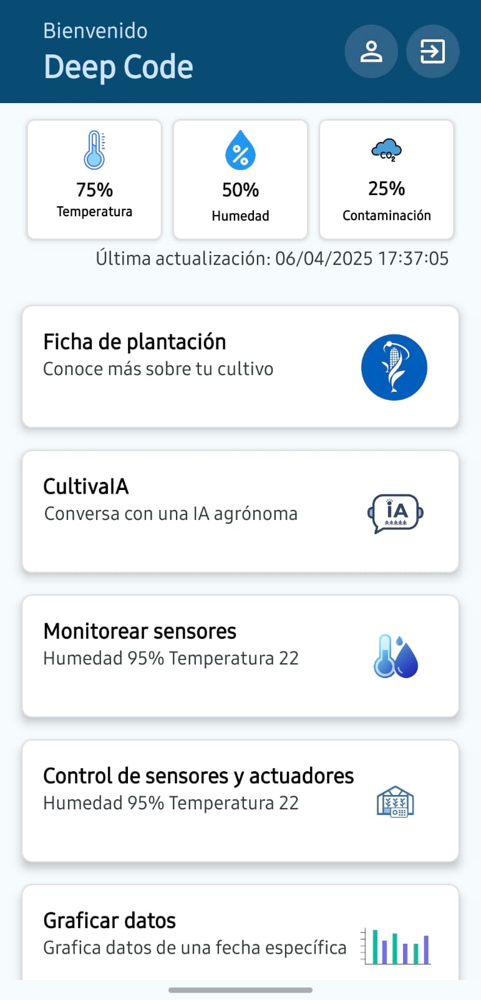
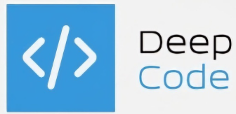

# 🌿 SmartGreenhouse

> Aplicación Android desarrollada por **DeepCode** para la gestión inteligente de invernaderos, combinando monitoreo ambiental, información agrícola y asistencia por IA.  
> 🌱📡🌽 **Tecnología al servicio del campo.**



---

## 🚀 Funcionalidades destacadas

- 📡 **Lectura en tiempo real** de sensores (temperatura, humedad, gas).
- 📊 **Gráficas interactivas** con límites visuales y diseño limpio.
- 🌽 **Sección agrícola** con información útil sobre el cultivo de maíz (características, tips, buenas prácticas).
- 🤖 **Asistente con IA** usando la API de [DeepSeek](https://deepseek.com) para resolver dudas.
- 👤 **Interfaz de usuario personalizada** para usuarios y administradores.
  - **Usuarios**: monitorean y consultan información.
  - **Administradores**: gestionan cuentas y controlan los umbrales de sensores.
- 🎨 **Diseño moderno con Material 3 (Material You)** para una experiencia visual fluida y responsiva.

---

## 🛠️ Tecnologías utilizadas

- **Lenguaje:** Java  
- **IDE:** Android Studio  
- **Build System:** Kotlin DSL (Gradle)  
- **Diseño UI:** [Material 3 (Material You)](https://m3.material.io/)  
- **Librerías clave:**
  - [MPAndroidChart](https://github.com/PhilJay/MPAndroidChart) – Gráficas.
  - [Retrofit](https://square.github.io/retrofit/) – Conexión con APIs.
  - [DeepSeek API](https://deepseek.com) – Chat IA.

---

## 🧩 Módulos principales

| Módulo | Funcionalidad |
|--------|---------------|
| 📈 **Sensores** | Visualización de datos en tiempo real con gráficas dinámicas. |
| 🌽 **Info Maíz** | Tips agrícolas, características y buenas prácticas. |
| 🤖 **Chat con IA (CultivaIA)** | Asistente inteligente para resolver dudas agrícolas. |
| 👥 **Gestión de Usuarios** | Roles diferenciados: Usuario / Administrador. |
| ⚙️ **Menú Admin** | Gestión de usuarios y monitoreo avanzado. |

---

## 🔗 Repositorios relacionados

- 🌐 **API del proyecto (hosteada en GitHub)**:  
  📁 [`DeepCode/SmartGreenhouse-API`](https://github.com/DevOjeda016/SmartGreenhouse)
- 🧠 **API de IA**: [DeepSeek](https://deepseek.com)

---

## 📷 Capturas de pantalla

| Login | Chat CultivaIA | Gráficas | Panel Admin |
|----------|-----------|---------|-------------|
|  |  |  |  |


---

## 📦 Instalación

```bash
git clone https://github.com/DevOjeda016/SmartGreenhouseApp
```
Abre el proyecto en Android Studio.

Configura los endpoints de la API en los archivos correspondientes.

Ejecuta en un emulador o dispositivo físico con acceso a internet.

¡Listo para monitorear tu invernadero!

## 🧑‍💻 Desarrollado por
**DeepCode**



Equipo de estudiantes de Desarrollo de Software Multiplataforma.

> Proyecto desarrollado con ❤️ por el equipo **DeepCode**.

## 💬 Contribuciones
¿Te gustaría mejorar esta app? ¡Eres bienvenido a abrir issues o pull requests!

## 📄 Licencia
MIT License – LICENSE
